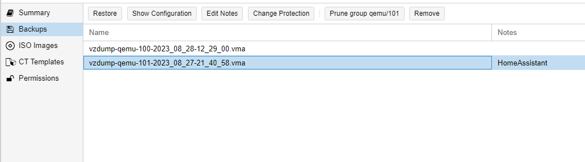

# Proxmox_MigratingVM

What is this? 
- This will explain how to simply move VM from one Proxmox machine to another Proxmox machine.
- This is based on default installation and configuration of Proxmox
  
1. Logon to Proxmox source machine
2. Select machine from left menu
3. Select Options and set Start at boot = no to not start machine at both Proxmox's at same time after reboot or other actions

4. Stop the machine before backup
5. Select Backup from menu and Backup now

6. Use settings on Backup now like on screenshot

7. Backup will be visible - note file name
8. Logon through SSH to source Proxmox
9. By default local storage (if nothing was changed) is located at /var/lib/vz/dump
Move to this directory:
cd /var/lib/vz/dump
10. Using SCP copy files to target Proxmox
Remark: during copy replace extension with *, use your user instead of root if you have one, replace ip 10.0.0.1 with yuor Proxmox target machine
scp <filename_of_backup*> root@10.0.0.1:/var/lib/vz/dump
11. Logon to target Proxmox
12. Select from left menu position local and then select Backup, you should see backup file which was uploaded few minutes earlier

13. Click Restore and modify VM number if you want, if not leave default, it will select first available VM number, Click Restore to start Restoration of machine

14. After successfull restore you should see machine in menu
15. If required set machine again to start at boot of Proxmox

You're done, machine is transfered to new Proxmox server.
